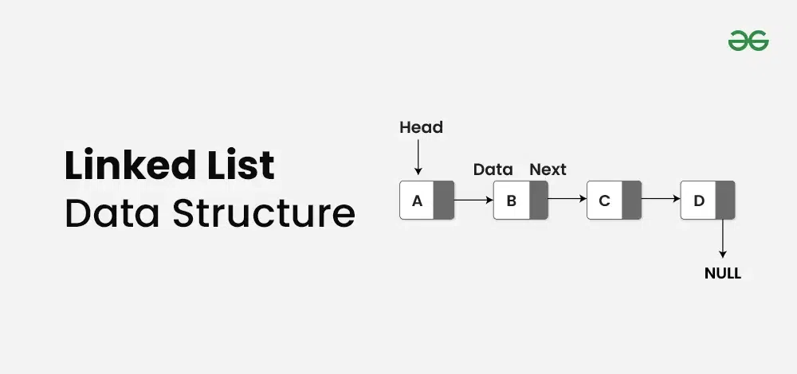

# Concept:

A linked list is a fundamental data structure in computer science. It consists of nodes where each node contains data
and a reference (link) to the next node in the sequence. This allows for dynamic memory allocation and efficient
insertion and deletion operations compared to arrays.

## Operations of Linked Lists:

1. Linked List Insertion -- Done
    - Insert at the head
    - Insert at the end
    - Insert after a given node
2. Search an element in a Linked List (Iterative and Recursive)
3. Find Length of a Linked List (Iterative and Recursive)
4. Reverse a linked list
5. Linked List Deletion (Deleting a given key)
6. Linked List Deletion (Deleting a key at given position)
7. Write a function to delete a Linked List
8. Write a function to get Nth node in a Linked List
9. Nth node from the end of a Linked List

## Linked list vs Array:

**Linked List:**

- Data Structure: Non-contiguous
- Memory Allocation: Dynamic
- Insertion/Deletion: Efficient
- Access: Sequential

**Array:**

- Data Structure: Contiguous
- Memory Allocation: Static
- Insertion/Deletion: Inefficient
- Access: Random (efficient)

## Types of Linked List

- Singly Linked List
- Doubly Linked List
- Circular Linked List
- Circular Doubly Linked List
- Header Linked List

## Linked List Applications

- Implementing stacks and queues using linked lists.
- Using linked lists to handle collisions in hash tables.
- Representing graphs using linked lists.
- Allocating and deallocating memory dynamically.

